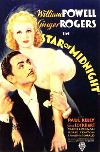

\[caption id="" align="alignright" width="200"\] Star of Midnight (Photo credit: Wikipedia)\[/caption\]

If I had to nominate an author capable of creating a god, it would be Neil Gaiman, and I don't just say that because I've worked with the Endless. In American Gods, Gaiman included the Slavic goddesses referred to as the Zorya. He listed three sisters, the Evening Star, the Morning Star, and the Midnight Star.

It's that Midnight Star, Zorya Polunochnaya, that I find most fascinating. Not that her sisters are not lovely ladies in their own right, but that, before American Gods, she didn't exist, and now it's nearly impossible to do any real research on the Zorya without encountering her.

Now, there's every indication that she exists. Polunocnica, the Lady Midnight, turns up if you do research. She's generally paired with the Lady Midday, Pscipolnitsa, and not the Zorya. The Lady Midnight and the Midnight Star, while they have obvious similarities, are not the same lady.

And yet I've met the Midnight Star.

I couldn't tell you if she was another form of Poluocnica or if she existed independently. But she is as real as her sisters, and I've danced with her in the starlight.

Sometimes I enjoy theorizing about what this sort of thing means. Gods and powers, names and honors, egregores and tulpas. In practice, though, does it matter? The lady answers to the name Zorya Polunochnaya. That's good enough for me.
