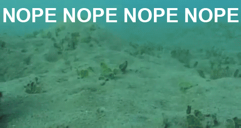

\[caption id="" align="alignright" width="333"\] Nopetopus\[/caption\]

Traits: Strong boundaries, knowing your limits, speedy exits

You see before you the Noble Nopetopus, a fine specimen of a GIF. He is most often found immediately following an idea or image that is simply too much to contemplate.

Nopetopus knows his boundaries. Life is too short for some things, and nopetopus is not going to spend his time thinking about giant crabs the size of trashcans, or horrifyingly ignorant racist commentary, or Slenderman's possible reality as a thought construct. Nopetopus says fuck that, I've got better things to do. Over here. Away from that.

Boundaries are important, but we overlook them much too often in the pagan community. We're expected to enter sacred space with people we've just met. Sometimes we're asked to go skyclad with them. I've been to blots where I was asked to witness a sworn oath when I hardly knew the person swearing and wasn't sure if I wanted to tie my wyrd to his. All of these things can be worth doing, but there's a whole lot of assuming that happens in the pagan community.

I just recently re-established contact with a former friend after about a year. Things had been awkward and we both needed the space. Now we're trying to figure out if being friends again is an option, and we're both taking it slowly and keeping an eye on our own boundaries. I'm glad to be in touch with her again, but at the same time I don't want to push her too fast. I think we're both a little hesitant to get invested, and it doesn't help that we each have a lot going on right now.

That's okay. Friendship is not a switch with only two settings. You can take your time with someone. You can back off. You can tentatively reach out. You can read facebook and leave little comments and not pour your heart out; that doesn't make it fake. A lake is not a fake ocean, no matter how small or shallow it is; it is a lake.

The same is true of gods, most of the time. There's an entire range of experience between "I think I have read about this god before" and "I'm marrying this god" and it's okay to take your time and relish all those steps in between. It's okay to have gods you only talk to occasionally, as long as those gods are also on board wit that level of relationship. Great depths are good for poetry and whale-watching, but sometimes you just want to do a little fishing or take a walk around the shore. Sometimes a lake is perfect.

You don't have to go scuba diving until you're ready, and it's okay not to be ready. It doesn't mean you don't think your gods are real or that you're treating them like vending machines. It's possible to do that, but it's not necessarily part of the deal.

If you need help asking for what you need, or saying no to what you don't need, call on the Noble Nopetopus, and shake your head proudly, and say "No, sir! I don't like it!"
