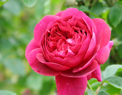

\[caption id="" align="alignright" width="240"\] Rose The Dark Lady バラ ザ・ダークレディ (Photo credit: T.Kiya)\[/caption\]

I'm pretty much chronically late to the party - between full time work, full time school, and trying to pretend I have hobbies, I don't get to do a lot of reading outside of the blogs I'm already subscribed to. That is my excuse for not checking out [Aine Llewellyn](http://www.patheos.com/blogs/ainellewellyn/) before now. I was browsing his posts about the Otherfaith and the deities he works with, and thinking how interestingly they were clear incarnations of Powers and yet were quite distinct from other, similar deities.

I thought about my essentially-nameless [Dark Lady](http://jackadreams.info/2013/02/14/d-is-for-the-dark/ "D is for the Dark"). I thought about the tentative work I'm doing with [Chenek](http://jackadreams.info/2013/05/08/atlantean-ascended-masters-and-me/ "Atlantean Ascended Masters and Me"). And I began to wonder if maybe I wasn't doing the others a disservice by reaching for named Gods as ways to those Powers instead of learning names or going without.

Did I take the easy way out?

Is this another layer of peeling back the onion and finding what I'm meant to be doing is still further in?

This is going to require some divination and some serious Sitting Time to figure out.

It's hard because I've certainly worked with Odin and Loki, with Mara-whom-I-love, with the pop culture deities and the obscure ones. But maybe, just as I eventually understood that I wouldn't find [my Dark Lady](http://jackadreams.info/2012/04/03/our-lady-of-suicidal-ideation/ "Our Lady of Suicidal Ideation") amongst the gods known in this world, I need to learn that about the others as well. I reached out to all the Firebirds I could find in my attempt to understand myself as Firebird, after all, and that process made the understanding I came to that much stronger.

It doesn't mean I'd stop working with Dear Mara or anyone else - I still work with Kuan Yin and some of the other ladies of the darkness. But if there's more I should be doing, I need to acknowledge that and figure it out.

I suspect what it comes down to is: my work with Firebird and Dragon, and with the Dark Lady, is by far the most useful, sweeping work I've done. That's what touches me and what changes me.

I don't suppose anybody reading this has been in a similar place? Suggestions and advice for figuring this out would be appreciated.
