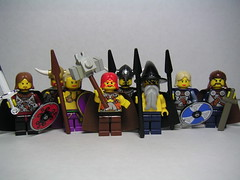

\[caption id="" align="alignright" width="240"\] Norse Gods (Photo credit: Dunechaser)\[/caption\]

My relationship with Mara is... complicated. I already wrote about that, no surprises there. But in general, most of the gods I've dealt with have worked with me for a little while, showed me this or that that I needed to know, and then patted me on the head and sent me on my way. Ereshkigal, Hel, Xuan Nu, Kuan Yin, Angrboda, all of them gave me some quality time and then said "good luck, kid." Finally I came to the realization that my Dark Lady wasn't a goddess I was going to find in a mythology text book, and I worked my way around to being okay with that.

It was the same with the gods of the forge. I worked with Brigid, and with Wayland, and with Ilmarinen. Each passed me along, and though I never quite sewed it up, I think I was close to reaching that same conclusion I came to with the Dark Lady. The waters, well, yes, [they did it too](http://jackadreams.info/2013/03/17/the-rushing-water-and-the-deep-blue-sea/ "The Rushing Water and the Deep Blue Sea").

About the only gods who didn't are Mara, Odin and Loki. Mara, I've dealt with. My understanding of her has shifted before, it's not as big of a deal.

Odin and Loki, though... They're shifty bastards. I have no reason to doubt that the faces they've claimed were theirs were, in fact, them. I suppose it's possible they just happened to get ahold of me young, and lord knows I've described Odin as a Mr Grabby Hands myself. He's not the sort to pat anybody on the head and send them off if he finds them more useful where they are. And lets be honest, I was sort of shoehorning them in anyway, because I _wanted_ them to fit. But they don't have to fit; it's not like I need anyone's permission to continue liking them.

It just means I need to take a closer look at who's actually supposed to be there, when I look at Air and Fire.
