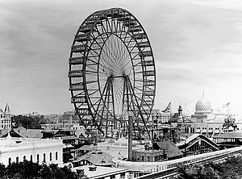

\[caption id="" align="alignright" width="300"\] The first Ferris wheel from the 1893 World Columbian Exposition in Chicago. (Photo credit: Wikipedia)\[/caption\]

(First, if you haven't heard about the [Pagan Bundle](http://paganbundle.com?ref=zv) yet? Apparently it's going to be the same principle as the Humble Bundle, a selection of ebooks for a single price. They're just starting out and haven't listed the products yet, but you can sign up and get an email when it goes live.)

But yes, O is for October. Not the month, the concept.

I [talked a little bit last year](http://jackadreams.info/2012/09/13/s-is-for-showman/ "S is for Showman"), in the fall, about Bradbury's October Country. October is liminality, the space between - between holidays, between seasons, and of course it culminates in Samhain.

October, for me, is the place where you belong by virtue of not belonging anywhere else. It tends to have a feeling of just-passing-through, related to the Carnival. It doesn't feel permanent.

I'm not sure if liminality can be permanent. Of course there are places that are liminal all the time, like train station, but not many. Most amusement parks are singular. Many places are liminal only on certain days, or certain times of the year.

I wonder sometimes if I can really do this - build a home, build a family. Settle. It's giving up something in exchange for something else, certainly.

Whatever the result, I'm starting to think it's worth it.
