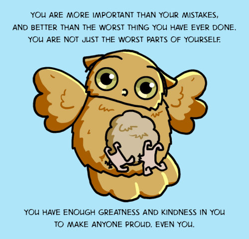

Traits: self-care, kindness, emotional honesty

Boggle is worried about you! [Boggle is also an owl](http://boggletheowl.tumblr.com/).

When you read advice columns regularly, you start to get a sense for what the advice will be in any given situation. Allison of [Ask a Manager](http://www.askamanager.org/) will tell you that it's legal. [Dan Savage](http://www.thestranger.com/seattle/SavageLove?oid=17272218) will tell you to be GGG unless you need to DTMFA, and [Captain Awkward](http://captainawkward.com/) will tell you to use your words. Because of this, I'm able to consult my array of inner advice columnists when I don't trust my own neurotic thought scripts. It's like having a bunch of advice column power animals waiting in my heart chakra to tell me to slide. Hands down, the most helpful advice spirit animal has been [Boggle the Owl](http://boggletheowl.tumblr.com/).

Boggle gently encourages people to own their feelings, not shy away from them. Your feelings are yours, and they are legitimate whether you can act on them or not.

Boggle loves you no matter how terrible you think you are. Boggle gives hugs when you need them but doesn't push you when you'd rather not.

Boggle says you are stronger than you know.

I told someone on a message board once that Kuan Yin sounds a lot like Boggle the Owl. My wife can sound a lot like Boggle too, when I'm having a bad day. But it's been incredibly helpful to be able to consult the Boggle in my head, who is there to tell me that nothing is the end of the world except the end of the world, no matter what I'm in the middle of doing. Boggle teaches me to take care of myself helps me find the words to take care of others.
