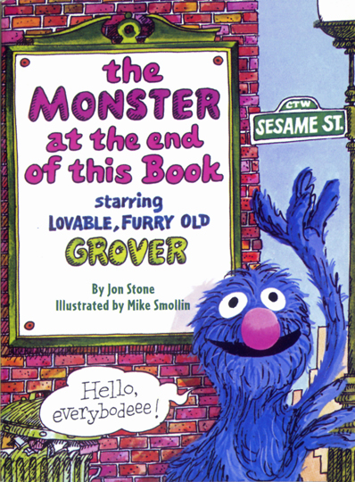

\[caption id="" align="alignright" width="239"\] Spoilers!\[/caption\]

Each night, after my wife goes to bed, I sit with myself and seek to [turn the page](http://smollin.com/michael/tmonstr/mon001.html).

The bindings I have build for the Monster are numerous and varied. One day it is glue, another it is ropes, and yet another it is bricks. Each represents a lesson I took to heart about something that was wrong with me and needed to be hidden.

Each night I defy the fuzzy, blue guardian of my inner Monster. Each night he confronts me with fears and anxieties, with my scrupulosity, with what people would think if they knew how terrible I am.

Muppetwork is not very impressive, I don't think. Other people are doing major devotional work, writing books, ascending to new heights of understanding, new spiritual towers. Me, I am going _down_. I am going _in_. I am slogging through my book, toward the inevitable finish. I just keep turning pages.

The monster at the end of the book is myself. Unlike Grover, I knew this before I started. My problem is not that my monster will eat you or me up. My problem is that freeing him is only the beginning.

I am no longer sure if my goal is to put on my wolf suit or remove my person suit. Perhaps it is both.

The monster is myself. The monster is free, and I am a nervous wreck. Now what?
