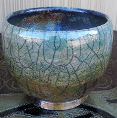

\[caption id="attachment\_5479" align="alignright" width="196"\] Raku Offering Bowl\[/caption\]

I made my pilgrimage down to the Oregon State Fair today. It's about an hour south of Portland, but the drive was nice and it was sunny without being too hot.

Fairs are important - they're a celebration of the products of the land, for one, and so I visit in honor of Mara. There's the midway, and so I visit in honor of Professor Dark. But the problem with things that are scheduled, whether holidays or festivals or whatever else, is that sometimes you're just not feeling it.

I was up late doing accounting homework. It was hot in most of the fairgrounds, and more crowded than I'm generally comfortable with. I didn't bring as much cash as I should have, and my wife didn't feel well, and all in all it was not optimal.

That's not to say I didn't have fun. I got to watch some great glassblowing and blacksmithing demos. The pottery school had DIY raku glazing and so we came home with two new altar pieces.

But by the time we made it to the midway, it was a slog. It wasn't fun. And sometimes there comes a point where you declare that it was a good idea but it's not quite working out. Today was one of those days. I went through the motions, but I didn't feel it.

Sometimes that happens. I think following through is important even when you're not getting everything you'd like out of a relationship or a ritual, but it's also important to be realistic with yourself. Sometimes it doesn't click, and that's okay.
