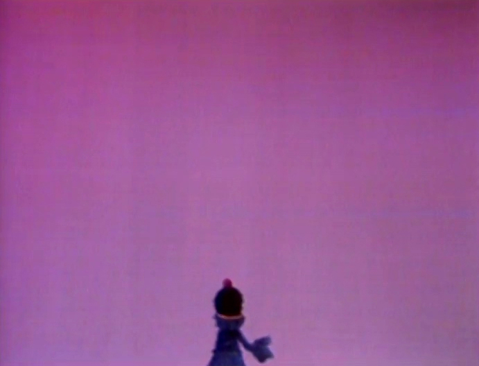

\[caption id="" align="alignright" width="277"\] Far!\[/caption\]

This post is a bit of an odd duck, in honor of Jim Henson's birthday. But I've been chewing on it since last month when I did the [Monster At the End of This Meditation](http://jackadreams.info/2013/08/20/the-monster-and-the-end-of-this-meditation/ "The Monster and the End of this Meditation"),

Traits: enthusiastic, lovable, furry, blue

Grover has always been my favorite. He is a Muppet of Many Hats, who plays a variety of roles and can teach many lessons.

As the long-suffering waiter trying to please Mr. Johnson, he is an inspiration to the many people who work in customer service. He gets frustrated - he's only human, er, monster, after all - but he never lets it get the better of him.

As Super Grover, he knows that there is nothing more important than helping people, even when you're not entirely sure how to do it. The act of honestly trying is important, and even if you don't succeed, the effort matters.

To know Grover is to know that there is always someone on your side, willing to help because helping is the thing you do. That's a hell of a thing to know, when it's dark and you're alone, or you need company, or you're just a little overwhelmed and you need a little help waiting tables or selling some slightly used letter Vs.

Super Grover always comes when you ask for help.

And Jim Henson is the man I have to thank for that.

(Also Frank Oz, but that's another post.)
