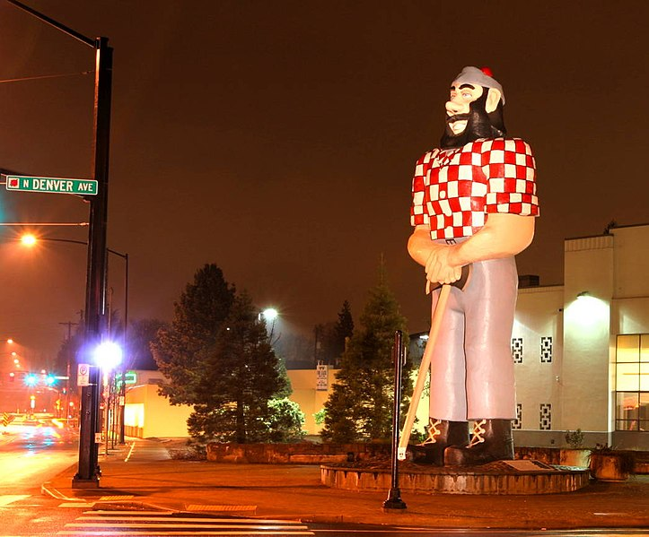

\[caption id="" align="alignright" width="304"\] Paul Bunyan\[/caption\]

I've talked about city spirits that are the energy or personification of a city or a neighborhood, but I don't think I've talked about urban legends in that context. Portland is a great city for this, but almost all cities have a few of these urban legends, folk heroes, and so on. You can leave an offering to Walt Disney in Anaheim or Harvey Milk in San Francisco - and in Portland we can call on [Joan of Arc](http://racc.org/public-art/search/?recid=1348.251), [Theodore Roosevelt](http://racc.org/public-art/search/?recid=1192.183) and [Abe Lincoln](http://racc.org/public-art/search/?page=details&featured=yes&recid=1323.283) - but you can also offer to the... less historical spirits that every city has.

Portland has a wide assortment of these spirits. There are structures, like the [many bridges](http://jackadreams.info/2012/10/17/bridges-of-multnomah-county/), that each have their own personalities and energies. Another good place to start meeting urban city spirits is by looking at the statuary you have around you. The best pieces are the ones people see and even interact with every day - like velveteen rabbits, they start to take on the characteristics we see in them.

Here in Portland, we have Paul Bunyan, who can be called on when you're battling big business. There's [Allow Me](http://en.wikipedia.org/wiki/Allow_Me_(Portland,_Oregon)), the spirit of shared transportation - he's explicitly linked to cabs, but I've invoked him in the name of getting the MAX to run on time, too. There are the [Skidmore Fates](http://en.wikipedia.org/wiki/Skidmore_Fountain), whom I've entreated for good luck and coincidence. There's Ramona and Henry in [Grant Park](http://en.wikipedia.org/wiki/Grant_Park,_Portland,_Oregon), if you're in the mood for invoking fictional characters - Ramona's a great one to call on if you need a little chaos.

There are also a variety of animal sculptures if you're looking for a focus when dealing with animal spirits. There's the [Thompson Elk](http://www.oregonlive.com/O/index.ssf/2011/11/the_thompson_elk_after_111_yea.html) downtown on Main Street, who I've called on for protection, as well as [cats](http://en.wikipedia.org/wiki/Cat_in_Repose), [bears, dear, beavers, otters](http://racc.org/public-art/search/?recid=1139.244), and [Chinese elephants](http://racc.org/public-art/search/?recid=2019.239) - and that's just off the top of my head.

Want to get to know the people in your neighborhood?

Start by thinking about the places you pass regularly that seem to have personalities of their own. They might be statues or man-made structures, or they might be parks or natural features that have their own active land wights. If there's a place or a piece that you're drawn to, you can spend some time with it to get to know it, and maybe leave a small offering. From there, it's pretty much the same process as getting to know any other spirit or small god, just more immediate because you know exactly where that spirit lives.
