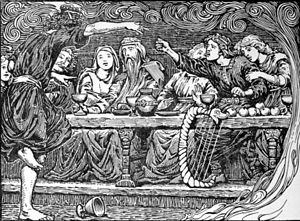

\[caption id="" align="alignright" width="300"\] Rap battle in honor of Loki? Sure, why not? (Photo credit: Wikipedia)\[/caption\]

When I was in high school, I had an English teacher whose response to questions like "can I go to the restroom?" was "I don't know, can you?"

I kind of hated her class. 

But I still think about her every time I'm on a message board or Tumblr and someone asks "can I?" You know the drill. Can I offer Loki this, can I worship these two gods together, can I work with Lucifer without going to hell, can I practice seidh, can I be devoted and still have a life, can I read tarot as a heathen... It's endless. And I always, always think about replying with "I don't know, can you?"

The only way to really find out is to try it, or ask the gods about it, and see what happens. Does Loki want that offering? I'd imagine the person who knows that best is Loki. 

Generally if I'm curious about a practice, I'll do some research and then ask myself: why not try it? If there's a real safety concern, sure, I'll probably hold off on fire dancing until I have an outdoor space to do it in. If there's a good reason not to that turned up in my research, I probably won't offer Loki... I dunno, entrails as an offering.

But if you're worrying about whether or not Loki likes spongecake or tarot cards are worth the effort for followers of Odin, you're not going to find a definitive answer on the internet. The best way to find out is to try it and see what happens. The answers aren't going to be the same for everyone, but that doesn't mean you shouldn't test your hypotheses and see if they work like you  used to do in school. In fact, it's all the more important that you test your own theories because no one else can do it for you.
