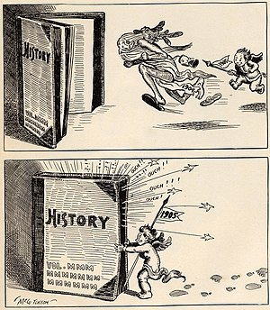

\[caption id="" align="alignright" width="300"\] Cartoon showing baby representing New Year 1905 chasing old man 1904 into history. (Photo credit: Wikipedia)\[/caption\]

 

Not long after I started this blog, Deb started her [New Year, New You project](http://www.charmedfinishingschool.com/new-year-new-you-an-experiment-in-magical-radical-transformation/) and challenged people to come up with goals for the new year that we could work on, both magically and mundanely. [These goals](http://jackadreams.info/2011/12/15/playing-goalie/ "Playing Goalie") comprised some of the first things I talked about on this blog and I thought it might be interesting to revisit them.

 

1. Health - Well, when I did this two years ago, I didn't have insurance, and now I do and I'm seeing my doctor and all that good stuff, so that's definitely an improvement. Goals like "eating better" and "working out" are up and down. I did join a gym this year, because my wife's employer reimburses for it and therefore I don't end up in a shame spiral if I don't go all the time. I should probably go more, but it seems like I'm always busy lately.
2. Wealth - What am I busy with? Mostly work. I'm still working at the job I started shortly after beginning the original NYNY. I've also started doing freelance writing on the side, and I'm exploring some other "hussles" as I've seen a variety of people describe it. I've had quite a bit of luck with financial magic, so I'll take that.
3. Mind - I haven't been doing so good, but I did finally get my ass into therapy, so I'm hoping this qualifies as a turnaround.
4. Creativity - I actually stopped counting words this year, in part due to the aforementioned freelance writing. On the other hand, I've made more progress on Theos Logos than I have in probably eight years. I suppose that's a wash.
5. Magic/Religion - Well, to a certain extent this ties into the last category with the Theos Logos and the Project Protagonist stuff. My practice has definitely come a long way in the last two years. But I could be doing more - I'm behind on the Strategic Sorcery work, for one. I think I'm going to make an effort there as well.

 

I suppose the important thing is that I can definitely see progress from where I was two years ago. That's a nice perspective to have as I get ready for the second new year; I've been feeling pretty stuck lately, and I could use it.
