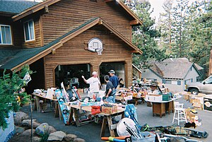

\[caption id="" align="alignright" width="300"\] Yard Sale Northern California May 2005. (Photo credit: Wikipedia)\[/caption\]

Speaking of things from ages ago...

About a year ago I wrote about being a [Secondhand Pagan](http://jackadreams.info/2012/10/29/secondhand-pagan/ "Secondhand Pagan"), finding altar pieces and other materials at thrift stores and yard sales. Over the some I wrote occasionally about yard sale finds and [honoring the ancestors at estate sales](http://jackadreams.info/2013/10/09/disir-and-estate-sales/ "Disir and Estate Sales"), but as the yard sale season waned I've let the subject drop but some conversations I've had offline made me want to revive the subject.

I'm thinking about doing a series of posts about being a secondhand pagan, about the sorts of things you can find at thrift stores and the like. I'm very fortunate in this area, as I live in a city with no lack of thrift stores, estate sales, and secondhand shops. I think with enough patience, though, a lot of it is do-able anywhere you have access to a decent thrift store.

My goal is to work my way through the standard neopagan altar, one piece at a time, with pictures and suggestions for different ways you can source each one secondhand. I've collected a lot of pictures at this point, so it's time to see if I can tie everything together.
