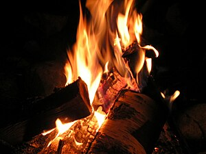

> I touch the fire, and it freezes me I look into it, and it's black Why can't I feel? My skin should crack and peel I want the fire back

\[caption id="" align="alignright" width="210"\] Lietuvių: Ugnis (Photo credit: Wikipedia)\[/caption\]

I've been struggling lately. Once I reach a certain state of overwhelm I shut down, fixated on nothing but the uselessness of everything. Certain things can cut through it, but not many.

This is one of the reasons I keep coming back to firebird work. It's different every time, and the periods between the lows, for the most part, seem to be getting longer. Sometimes I just need to spend some time remembering what I know. Sometimes I need to bank my coals and wait it out. Sometimes I go looking for a whole new way to burn.

When I was in some of my darkest periods, I used this song as a summoning chant to call the firebird in, or out of myself, one or the other. Both, maybe. The metaphysics don't matter, just putting one step in front of the other as I cross the coals. Just... remembering that I have something to sing about gives me the strength to wait it out.

> So I will walk through the fire Because where else can I turn? I will walk through the fire And let it . . .
