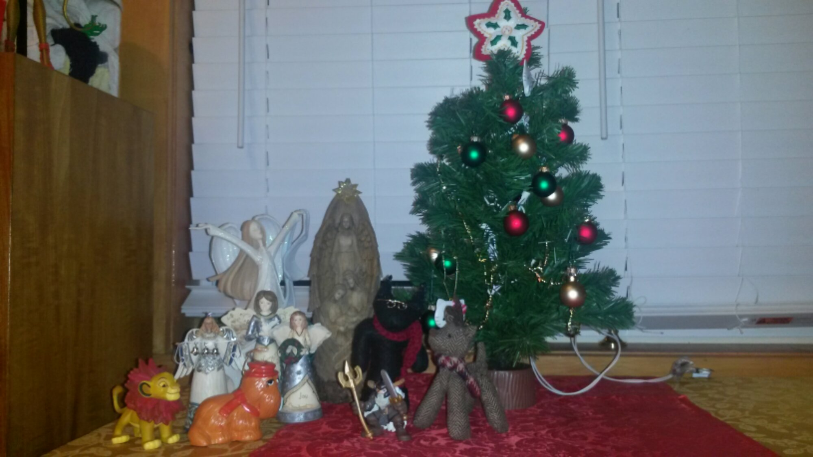

Wow, I'm almost done with this project... and also realizing just how much I have left to go. I thought this was a springboard when I started, but it's turned out to be a work unto itself. This is the last of my Holyday posts, since I started with Third New Year last year.

Friday afternoon was interested, as my office had it's annual Christmas party. There's no fun like mandatory fun, is there? I got home about the same time my wife got home from hers, and we put up the Yule altar - evergreen tree, nativity that came from my parents, Odin, Krampus, Snuffleupagus... You know, pretty traditional.

I stayed up all night Saturday night for the Solstice. It's a thing I really enjoy doing, but work schedules have made it impossible for the last couple of years. I did my best to keep candles lit in Mara's shrine all night. This week I'm off work, and I plan to do a lot of housework and organizing. We'll go to Midnight Mass at the Catholic church in town, because some habits die really hard.

Second New Year is about the spark in the darkness, the ability to start over when you're at your lowest. In terms of mental illness, this is probably the lowest I've been in years, so I'm hoping to use the energy of Second New Year to turn the corner there.

Bono says _nothing changes on New Year's Day,_ and in the long run that's true. The year goes around. The days continue. The only thing that ends is the calendar. But the reason that I celebrate three New Years is that it means that there's always a new beginning, too. Nothing ends, nothing changes, except that everything is always changing.
