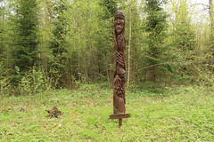

\[caption id="" align="alignright" width="240"\] Žemyna (Photo credit: Aurelijus Valeiša)\[/caption\]

Latvian mythology has a great many "mãte," or mothers, referred to  in folklore. Little is known about any of them, and there's speculation in the academic sources as to what they are and whether they are each separate goddesses, whether they're all titles for a single goddess, or if there's something else altogether going on. I have wondered if many of the mãte referred in the lore may be localized goddesses or very powerful wights, in which case it wouldn't be surprising at all that I got nothing but crickets when I reached out to them.

[Zemes-mãte](http://en.wikipedia.org/wiki/Zemes-m%C3%A3te "Zemes-mãte") in particular is the Earth-mother. In an effort to figure out what was going on with these mãte, I spent some time trying to reach out to her with candles and meditation, but I got no indication that they're separate. When I called to Zemes-mãte, I got Mara, so I go with that.

[Žemyna](http://en.wikipedia.org/wiki/%C5%BDemyna "Žemyna") is a Lithuanian earth goddess and mother goddess, and I've seen her listed as equivalent to Zemes-mãte. [Mat Zemlya](http://en.wikipedia.org/wiki/Mat_Zemlya "Mat Zemlya") is a Slavic goddess, also known as a mother-earth. She, in turn, is syncretized with or has as a handmaiden the goddess Mokosh, who is a goddess of spinning, childbirth and destiny and associated with Laima... or Mara.

Syncretization is not something I do lightly, but in this case, all of my research points to them being the same goddess known to different peoples. My UPG, based on my own efforts in reaching out and what Mara has indicated to me, falls the same way.

There can be a great many differing opinions when it comes to the subject of synchronization between deities. It's honestly not something I do lightly; I started out expecting the Earth Mother to be a different deity from Mara. I've been all but sent a registered letter telling me I was wrong about that, so I go with what I've been told.
