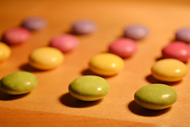

\[caption id="" align="alignright" width="240"\] (Photo credit: schnappischnap)\[/caption\]

Other people have done this rant and done it well but I still need to get it out of my system, so...

I've seen studies that determined that something like 1/4 adults with OCD also have social phobia or social anxiety disorder. My therapist has me working on this along with more generalized anxiety issues, and it's a real struggle. I've spent a long time thinking that I need to give in in favor of other people's comfort, and worry about how other people perceive me.

It's exhausting, and it's also impossible. I can't function if I worry about exactly what every person on the train or in the gym thinks of me, and I can't blog if I worry about pleasing everyone on the internet, and I can't practice if I worry about whether everyone would approve of my practice.

So what I have been practicing is saying "fuck this" and removing myself from debates that I find unhelpful. It's hard for me, because the SAD brain raccoons tell me that if I bow out of the debate, it's because I'm not a good enough pagan. A good pagan would stay, and debate, and cite sources and prove points and and and -

But these are not debates that anyone wins. My responsibilities are to my gods and spirits, and while that sometimes overlaps with online discussion, much of the time it doesn't. So when someone says something I find insulting or problematic, I am practicing the zen of saying fuck this. I remove myself, and I tell myself that removing myself is okay. I don't owe justification to anyone.

This meme has actually been very good for me, in terms of working out what does matter to me. I'm not sure what the official PBP is going to look like next year; I've heard rumors but not seen anything official. I'll be following along with the [Cauldon's version, most likely](http://www.ecauldron.com/forum/showwiki.php?title=The+TC-Blog-Project+2014), and we'll see how that turns out.
