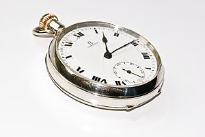

\[caption id="" align="alignright" width="300"\] English: A vintage Omega pocket watch of around 1950's origin. (Photo credit: Wikipedia)\[/caption\]

So that about does it for 2013. I suppose it's traditional to do a round-up, but I'm not very good at roundups. I can barely remember what happened last month. I did complete the Pagan Blog Project a second time, so that felt exciting, and I've almost got all the slots on the Project Protagonist page filled in. I don't feel too bad about having a few remaining since the list grew over the course of the year. I definitely feel more secure in my practices.

I did get a summary from Wordpress. Most of it was kind of useless, but it did tell me my top commenters this year were [Sophie](http://jarofstars.wordpress.com/), [Lily](http://littlexavier.wordpress.com/) and [Naomi](http://leithincluan.wordpress.com/). Thanks, guys!

All my blogging goals tend to come into play around this time of year. I think that's similar to why it's much easier to write a novel in November regardless of how busy I am - everyone else is talking about it, motivated. Things like the [Pagan Blog Project](http://paganblogproject.com) are resetting for the new year, and things like the [Cauldron Blog Project](http://www.ecauldron.com/forum/showwiki.php?title=The+TC-Blog-Project+2014) are getting started. Everybody's talking about what they're planning to do next year.

So what am I planning to do next year?

- The above-mentioned PBP and TCBP, for sure.
- I hope to finish up the remaining Project Protagonist posts before Third New Year.
- I'm also planning to spend a week with each of the cards in my divination deck. Conveniently, there are 52 cards in the current iteration of the deck, so this should work out neatly.
- I intend to keep doing the Secondhand Pagan posts. I've got enough images to go ahead with the next two or three, but if there are any requests, I'm happy to take them!
- I am working, very slowly, on a book for Mara.
- More writing about writing. I tried having a separate blog for writing, and it just didn't work out. That's probably due to both my short attention span, but it's also true that magic and writing are tied together for me, so it probably makes more sense to just have one blog and talk about writing here.

Oh, and there's one other major project in the works for the new year. I haven't really mentioned this here, but my wife and I will be having a baby in April. I'll probably actually talk about that more as we get closer, or maybe after she's born. I guess we'll see!
