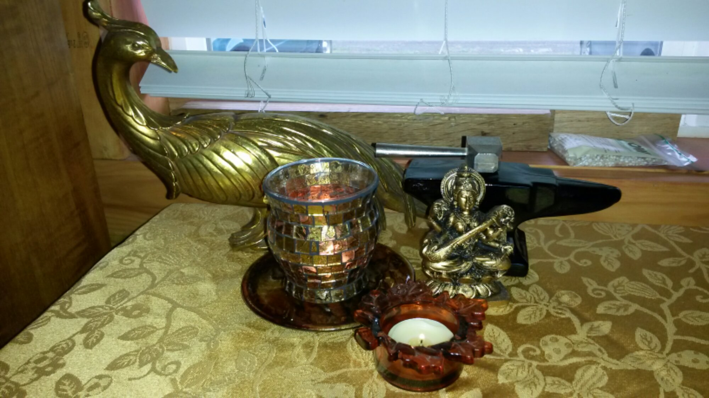

So [this post from Tom](http://serpentinetom.wordpress.com/2014/01/12/altars/) inspired me to actually make the altar for my workspace. In the interest of talking about secondhand paganism, I figured I'd mention where the things on the altar came from.

The Firebird in the back represents creative energy as well as an invocation specific to one of my fiction projects, where She is one of the primary forces moving the story. She's not often worshipped as a goddess there - she's a bit too primal and a bit too quiet for that - but she's important to my work. That gold bird came from the Value Village, not long after I moved up here. I've actually seen similar ones since but they're usually broken. I think I paid five dollars for her.

The anvil represents my non-writing creativity, specifically my metalwork. Obviously I can't forge here but I can solder. That piece is actually an old Avon perfume holder. I found it at a yard sale last summer for a dollar, still full of rank 70s cologne.

The gold glass candleholder has a lot of symbolic value - lit in the dark, it holds the light like forgefire. Cauldron-shaped, it reminds me of the story of Odin stealing the mead of poetry. I found it at a local animal charity thrift for a dollar several months ago. The plate it's sitting on actually just came home this weekend. It's part of a set of four with a wonderful metallic look in bronze and copper and red, and I got them at a furniture charity in Portland for three dollars.

The leaf candleholder in front was a quarter at a yard sale, and there are matching yellow and green ones elsewhere. The tablecloth is also from a yard sale, and cost me two dollars.

The Saraswati figure is the only new piece on the altar. I got her at a local new age store for seven dollars. I actually found a card with her on it at the Goodwill last weekend and considered using that, but I decided to use that in my planner instead.

I'm considering following Tom's lead and adding more things specific to my fiction, but I need to decide on the best way to go about that.

So there you go: how to build an altar for under twenty dollars. I am picky about my deity representation, so that was the most expensive part. I'm working on some more Secondhand Pagan posts, including one on options for deities. If there's any particular kind of altar piece you're looking for ideas on, let me know.
