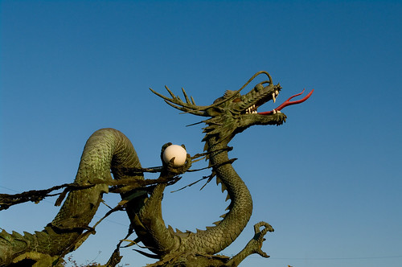

\[caption id="" align="alignleft" width="320"\] Dragon Statue by Lamoix\[/caption\]

Like the Firebird, "hard-type" in this context means the Dragon in his purest form, raw elemental energy. He's not incarnate, he is not limited. His general associations tend to stand in opposition to the Firebird - earth and water, primarily.

The Dragon tends toward arrogance, being removed from situations, letting things play out. He can be a warning against being too far removed, or he can be a sign that you need to keep your distance, depending on the context. Listen to him when he speaks, because he doesn't often bother.
