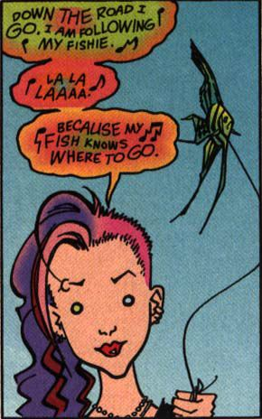

\[caption id="" align="alignright" width="232"\] Following my Fish.\[/caption\]

I've written a little bit about [my experience with Delirium](http://jackadreams.info/2013/09/30/the-mad-one-and-the-lucky-one/ "the Mad One and the Lucky One") before but I think any excuse to talk some pop culture paganism is a good one. I'm still very fond of, and grateful to, Delirium. I first met her in high school when I was dealing with some other issues. She was a great comfort in my first few years of college when I was first dealing with really intense panic attacks. She didn't (couldn't?) make them go away but she sat with me until they passed.

That meant everything to me at the time, when I hadn't yet been diagnosed with anxiety and I had no idea what was going on except that I couldn't go in the student union building during daylight hours.

Delirium is not technically a goddess according to her canon - she's something more than one - but can be related to as a goddess for all practical purposes. In my system she's the archetypal Mad One, the hard-type aspect of Chaos. Nothing is set or given fixed form in her domain.

When I went through my relapsed Catholic phase, I considered replacing Delirium with Saint Dymphna. She's the patron saint of the mentally ill and victims of incest; she's said to have been murdered by her mentally ill father, and her miracles generally consist of healing the mentally ill. Despite my Catholic upbringing, I never heard of her in my bible studies and CCDs.

I've reached a point where I accept my neuroatypicalities, though. I no longer spend effort yearning to be normal most of the time, and while I may desperately wish to be without anxiety when my brain raccoons are at their worst, I don't focus on the idea of a miracle cure. Instead, I have learned to embrace Delirium, sitting with my thoughts just as she sat with me when I was at my worst. When my mind is a rushing maze of rules and intrusive thoughts, I know that I can find my way out by following my fish - there is always a part of myself that knows where the exit is, even if I have to wait until I am too exhausted to keep fighting myself.

Inasmuch as I have a holyday for Delirium, I celebrate it on May 15, St. Dymphna's feast day. The best way to celebrate, in my opinion, is to take a mental health day if you can and engage in self-care to the best of your ability.
