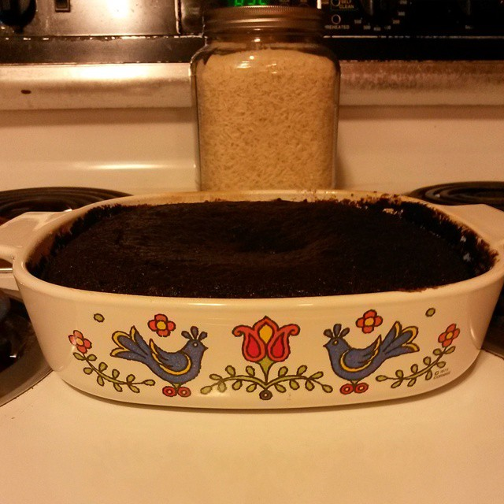

\[caption id="" align="alignright" width="275"\] Wacky Cake in some vintage Country Festival Corningware\[/caption\]

You know how a couple of days ago I said that if I wanted to be perfect, I'd learn to bake? Guess I must be after perfection, because that wacky cake in the image over there is mine.

Wacky cake is great because it's egg and dairy-free, and yet still manages to be delicious. I'm sort of curious if it'd still be good if you used a non-wheat flour, but probably not curious enough to try right now.

Hail to Mara and the Earth, and to new lessons, and to doing things I didn't think I could do.

I'm two days into NaNo and the story is already doing things I wasn't expecting. I'm getting to know my main character. She's Filipina, originally from Southern California by way of Phoenix. She doesn't trust the police; she mentioned she hasn't run from them "in years." She's a bit of an anarchist. One of my recurring characters showed up in chapter two almost by accident. I'd written several paragraphs before I realized I was describing him.

It's a good sign when the story is getting away from me. It means that I'm succeeding in plugging in to something that wants to be told, and that's especially helpful during NaNo when I'm running on whatever I can drop onto the page.

I don't usually stop to analyze my writing in terms of Theos Logos, but that state of writing-getting-away is a good one to be in. Whether you're writing something just to see how the story plays out or you're trying to tell a specific story, surprise means you're tapping into something higher than yourself. The whole point of this exercise is to go beyond myself and find something new.
