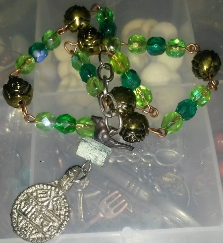

\[caption id="attachment\_7395" align="aligncenter" width="450"\] Glass and metal with kyanite.\[/caption\]

Other Mara-related things this month included finally sitting down and doing some things I'd been planning to do for a while now, including teaching myself to do rosary-style beading. The impetus for this was finding a pair of earrings in a thrift store with coin-pendants _and_ little birds on them, just as I was working on Bluebird's myth. The central piece of the beadwork above, with the bird, kyanite and coin pendant, came off the earrings as-is, in fact. I had been thinking about meditation beads for a while because I've had good results in the past meditating Buddhist-style with a mala, chanting for Kuan Yin, and before that, saying the rosary. Repetition is good for me.

In that respect, this style of beading also turned out to be a meditative action. It's just fiddly enough to hold my attention.

I'm not quite satisfied enough with the prayers to publish them yet, but the beaded section is simple faceted glass beads from the craft store. I know people who do gorgeous work with precious stone beads but I'm definitely not there yet. The dividers are little brass roses I reclaimed from broken thrift store jewelry. There are seven sets of three beads, seven being the number Mara indicated to use. Eventually I would like to do a longer one but I want to work that out beforehand. This is kind of a rough draft.
