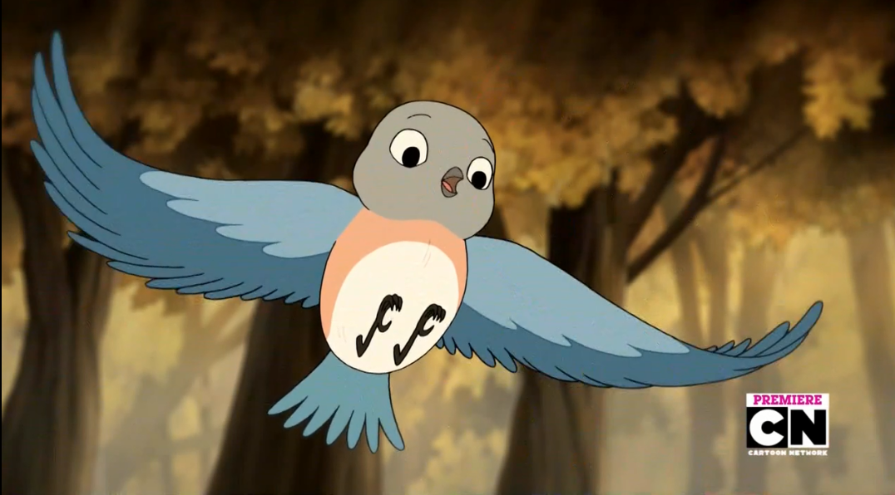

In response to my post [asking for questions](http://jackofmanytrades.info/2015/08/got-questions/), Aine wanted to know more about Bluebird:

Lost? Gone astray? Call for Bluebird to help.

She is excellent when you need help finding the path. It is one thing to have the door open for you, and another to know where you're supposed to go once you've walked through it. If Bluebird is on your shoulder, however, you can never go wrong.

\[caption id="" align="alignright" width="200"\] Bluebird (Beatrice from Over the Garden Wall)\[/caption\]

Bluebird is still very young in her heart and mind as well as her body when she takes a humanoid form. Offerings to her should keep this in mind.- she likes sweets almost as much as her brother, and is fond of small toys, fresh flowers and sparkly jewelry. It's easiest to honor her in conjunction with her mother or brother, but it's not required.

Most often if you call on her you will get her human form. However, she does also visit in her bluebird form sometimes. She acts as a protector of children and the wrongfully accused, and threatens only in her bird form.

My primary representation of her is a 'Bluebird of Happiness' glass statue I inherited as a child from my great aunt's collection, but I also use a humanoid figure with blue birds sitting on her arms. Visually and thematically, I was reminded of her when I saw Beatrice in Over the Garden Wall, though their personalities differ, especially from Bluebird's human personality.
