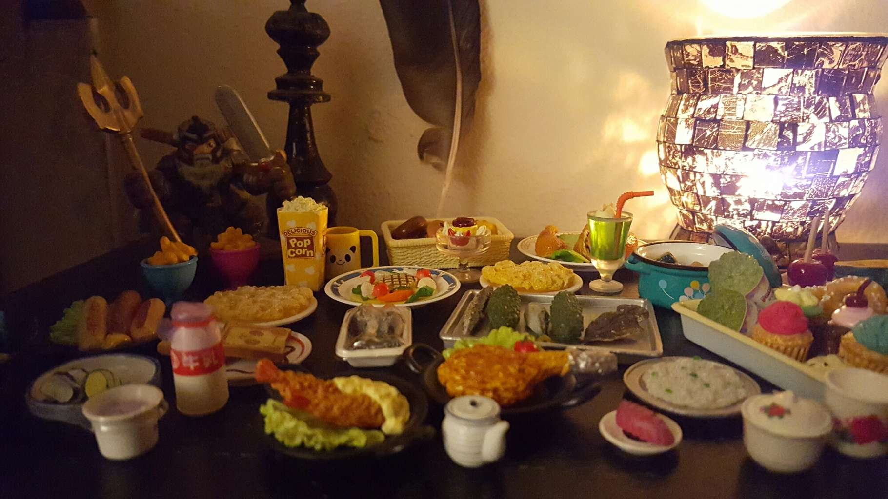

First New Year was an interesting one this year.

I had to work on the 31st, so I wasn't there for trick or treating. Nonetheless we read a board book about the Great Pumpkin and my child left her candy out as a sacrifice to the Pumpkin, who brought her Duplos instead.

Since I didn't have time to cook this year, on the 31st I laid out a feast of tiny doll food for the ancestors, and yesterday night I did actually have real food to leave out for them. The Hunt got offerings as well.

Sunday night I did the most formal ritual I have done in probably years, certainly since the baby was born. I'm still chewing on the results I got. The most difficult part is that I was told not to do any divination for myself or ask for any to be done for me before Yule.

This is an entirely reasonable request. I have a real problem with using divination as a checking behavior, continuing to ask questions when it's useless. Hopefully this will help me unlearn that.

I signed up for NaNoWriMo out of habit this year. I'm not going to make any write-ins and I probably won't make 50k but I'm going to write a bunch and count all the words and just... see how that goes.

Hopefully this will result in more posts here! I wasn't intending to go radio silent - I have a couple of posts in draft stage, even. Life just got away from me a bit and I haven't quite got it back yet. Life is good like that.
