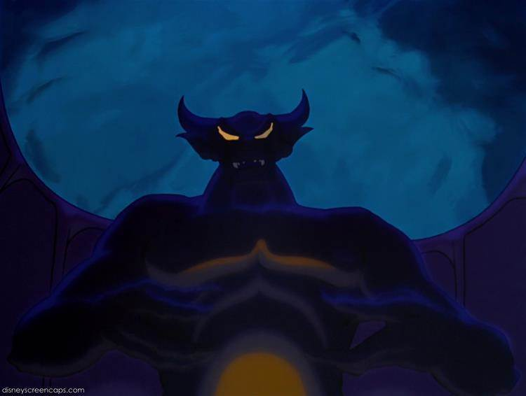

How many Slavic deities were you exposed to as a child? For me, the answer was only one.

On today's date in 1940, Fantasia premiered in New York City, and the Night On Bald Mountain sequence seared Disney's interpretation of the Slavic god in the minds of generations, for good or ill.

Hail to the Lord of the Lands of Yesterday, Tomorrow and Fantasy.
