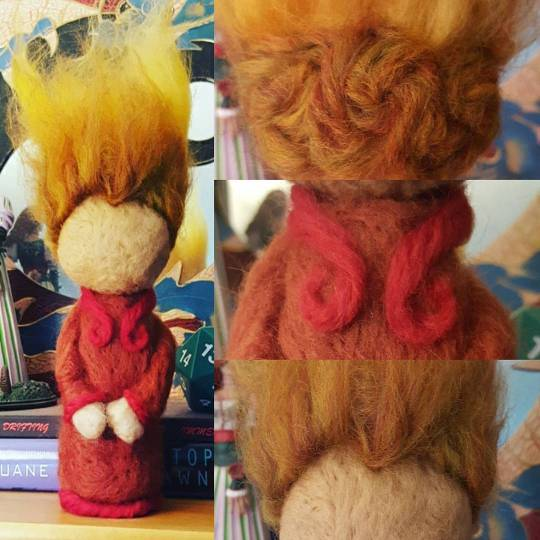

My sister did a card reading for me the other night, and the takeaway was "don't worry, keep going." She kept apologizing and pulling more cards, and the answer kept staying frustratingly the same, because there doesn't seem to be a way to tell cards "I get that but be more helpful, please."

I realize I'm the one who picked the theme for the year but somehow I didn't expect it to be applied to my life for me. I'd say "lesson learned" but... well, ha, probably not.

I have discovered a new kind of stabbing things that I'm enjoying: needle felting! To the left is my new representation of mom!Loki. I'm really pleased with the fire hair. She's my third project and the first time I've experimented with highly technical and complicated design techniques like _arms_. I can't tell you the last time I thought so much about how arms work, you guys. And hands!

Needle felt sculpture feels very intuitive to me. It's easy to pick up and put down, which is a bonus around a toddler. Unlike beading, I don't need to have a lot of small, easily-lost things out, which is also a bonus around a toddler.

Meanwhile, I'm slowly fleshing out a more complicated but still meaningful daily magical routine. "Just light a candle" is ths survival mode I fall back on when I can't do anything else, and I'd been in survival mode for too long. I'm adding complexity one thing at a time, trying things on - more daily practices and even a new moon ritual. I figure I can do anything for a little while and see how it goes.

For a while I was doing regular breath meditation after I [asked for discipline](http://jackofmanytrades.info/2016/04/failure-perfectionism-and-keeping-going/), but I was struggling a lot with my old friend Falling Asleep Sitting Up, so I switched styles to something a bit more active. It's working much better. Changing is not quitting.

I'm not sure what's next. I've got some more complicated needle felt ideas I want to work on. Maybe I'll make figures for some of the spirits I work with that are largely unknown, just to see how challenging it is to get a feel for what they look like.
