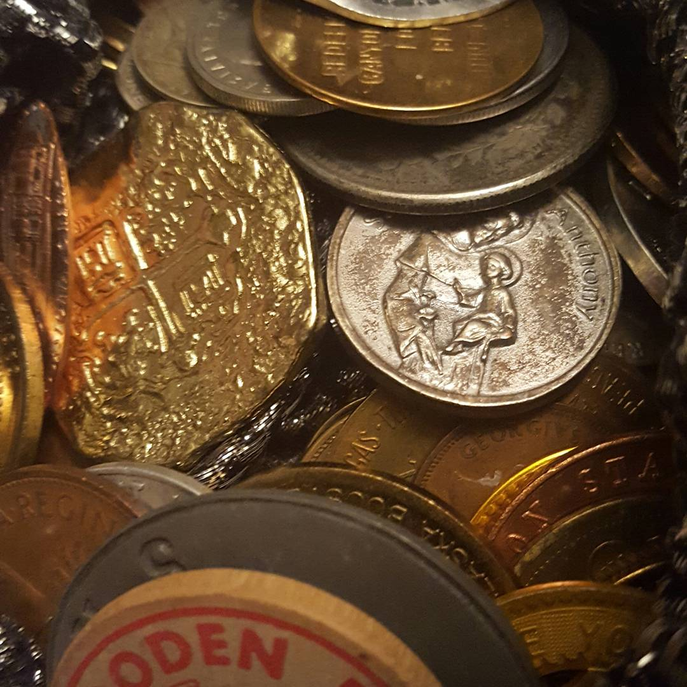
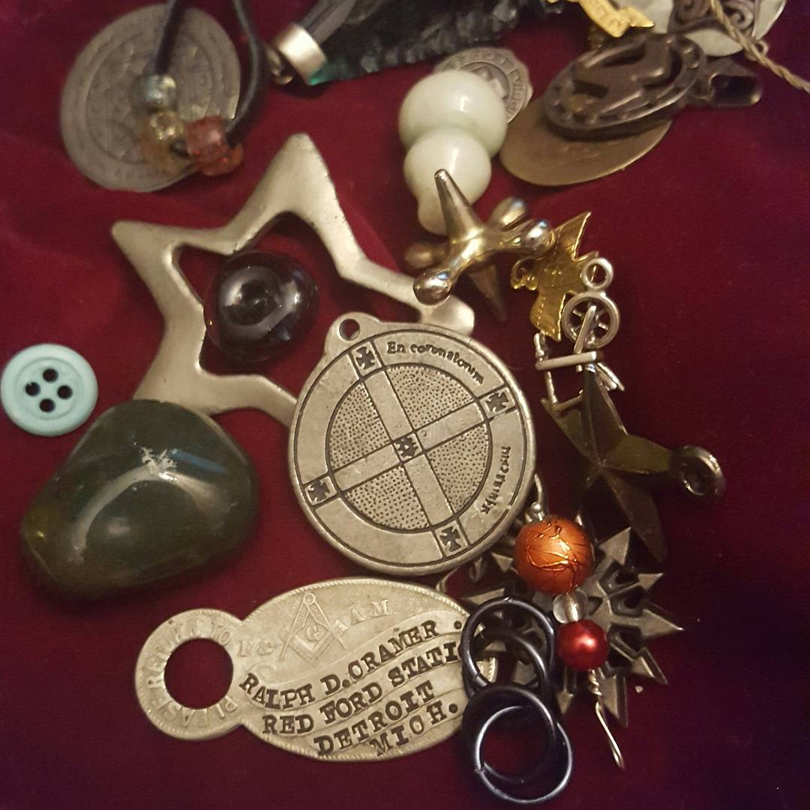

It was never really about the candles. Even when I was lighting them every night for Mara, even when it was the only thing I seemed to be able to do, it wasn't the candle that mattered. It was the remembering to do it. The attention. The energy they represent can be offered in other ways.

Representation and symbology is at the heart of not just sympathetic magic but many other techniques as well. I've been thinking about this off and on. Much of what I've been doing from Project Protagonist on has been about figuring out what symbols resonate for me and what they mean - not for other people, or according to this or that source, but what clicks in my head. Frankly, the more I play with divination systems, the harder a time I have with popular systems like tarot and runes.

I was reading this [post on divination systems](http://kylarathought.blogspot.com/2017/03/building-your-symbol-library.html) from Kylara earlier and her system of charms reminded me of the [Magpie Oracle](http://carrieparis.com/shop/magpie-oracle/), which reminded me of the Found Objects oracle (the link for which is unfortunately offline) which in turn reminded me of [Felix Warren's Road Bones](http://forscryingoutloud.tumblr.com/post/158619842999/these-are-the-road-bones-a-set-of-divination).

I feel better when I can point to the chores I've done. I feel better without the daily "frog" hanging over me. (And I know Bug's been watching a lot of Doc McStuffins... _I feel better, so much better, thank you Doc for taking all the ouchies away._)  This isn't perfection and it doesn't have to be, after all. Systems like the road bones and the found object oracle are meant to be actively changing systems, just like us. Pieces join. Sometimes pieces leave. The symbols we need in our lives change over time. _Father_ means something very different now than it did five years ago.

I pulled a coin from Mara's bag tonight. It was a charm from an old tourist attraction that reads "Frontier Town USA Salutes the Man of the Past." A lot of the pieces in the Calvinbag set, as I'm calling it in shorthand, are pieces I've had since I was a kid. They have layers upon layers of meaning thanks to my past selves. I know at a touch which of those star charms represents space and science and which represents magic and fae and yet it's only the current me that can draw the connection between them and conclude that stars represent knowledge.

The Dark Lady reminds me that this evolution is necessary and important. Who I am in the dark has never been who I am in the light, and both of those people are constantly changing. I am [a shapeshifter](http://jackofmanytrades.info/2016/06/28/on-shapeshifting/), after all.
