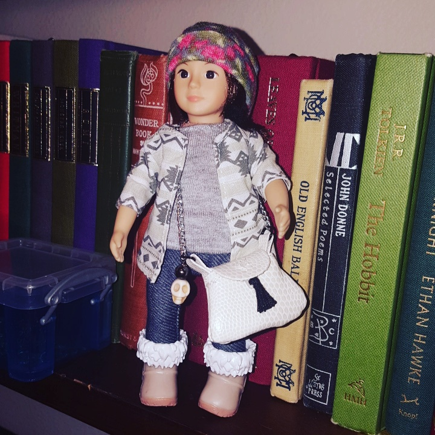

\[caption id="attachment\_9222" align="alignright" width="300"\] Tuesday's dollhouse shrine figure. Clothes are still a work in progress.\[/caption\]

Every week Tuesday has rolled around and I've somehow been sans prayer, despite having working models for everyone else, despite being completely sure I'm going to work on it this week.

On one hand, considering I knew almost nothing about Tuesday when I started, the fact that I now can contact him, interact with him, and know the outline of his mythology seems like some pretty good work to show for it.

On the other hand, well.  I hadn't actually done the assignment. I started with the format anyway, planning to make something up on the fly as I had last week and promising myself that later on I'd do it properly, maybe following the format from Felix Warren's course, or doing some meditative writing or something.

_Nope. Sit._

He made it clear that I was going to sit there and I was going to _write the damn draft,_ and despite getting distracted by a goose (goose necks are weeeeird y'all) and worrying about rain, I got it down. As a bonus, I got a few more notes on his personality, and a vocabulary edit. (Instead of "worker for my household" I'm experimenting with "voice of my household". What do you think?)

Tomorrow morning I have another doctor's appointment, because I think Wednesday is the only slow day at work that I _haven't_ had one yet. Maybe I have. I'd have to check my notes.

Anyway. I decided to pull a coin again tonight, and this time it was a commemorative coin for the 1996 Olympics with the logo for rowing on it. (Does anybody else remember those? They came in cereal boxes and I was obsessed with collecting them.) Sometimes you just have to keep plugging along, and sometimes plugging along hard enough is what wins you the medal.
