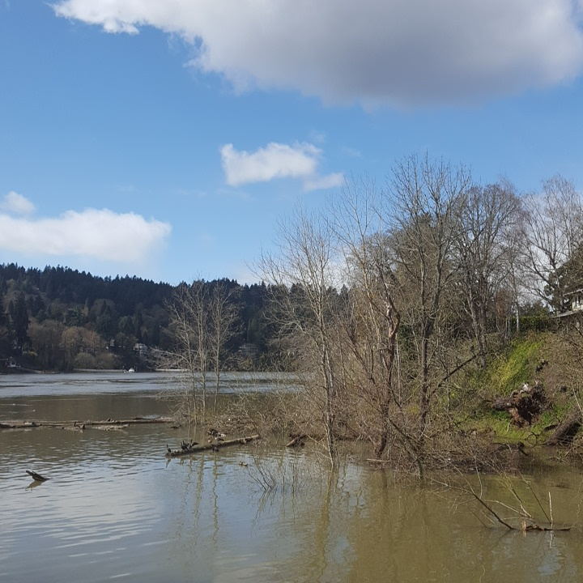

It was a good day for walking down to the river on my lunch. A guy could get used to this routine, I really could. Today I gathered all the prayers in a word document, and now I'm trying to decide what I want to do next.

I've done the same prayer for Velos and Pechak for three weeks now, at similar places, and it's starting to take on an energy of its own. Some of the other ones are almost there, but Pechak and Velos are... maybe the least picky? Or maybe just the simplest to reach out to. I knew what I was asking them for almost right away so it didn't take much tweaking.

Today's coin is a souvenir from the 1962 Penticon Peach Festival and Square Dance Jubilee. I associate peaches with Wehaz, the Merciful Fire. There is a certain fruit - and scholars can't agree which, of course, but some say a rare peach - that, when eaten, burns away the imperfections and ruts mortality leaves on your soul. It gifts enlightenment, or maybe immortality... You know, something like that. It's not unlike how Wehaz is in the wildfire that allows new growth and the forgefire that burns away impurities in metal.

Let go of what's holding you back. Sweep in the new and necessary.
