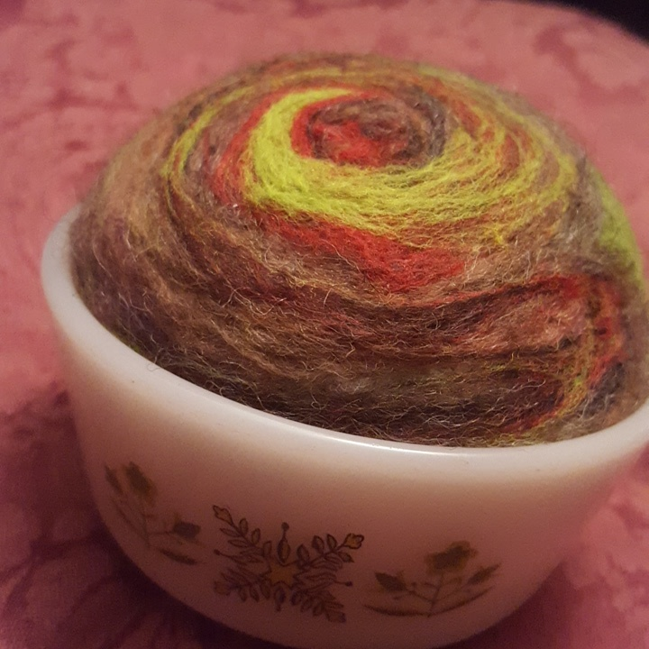

I had a conversation today that reminded me that recovery is complicated.

Given that this started out being about re-learning how to think about wards and shields, it was appropriate timing to be talking about my ex and the effects she had on people.

Often I don't think about my ex very much, but this was a very strong reminder that there are still places where, instead of working through difficult things, there are still areas where I put up a hasty drywall patch and moved on instead of addressing the structural issues caused by support beams she pulled out when she was renovating. If this was an episode of Property Brothers, they'd have discovered they need to pull out the whole ceiling or something.

(Following that metaphor, I guess the OCD would be like... Knob-and-tube wiring that couldn't be replaced? I dunno.)

If I'm going to be a project, I think I prefer a metaphor like This Old House or maybe Rehab Addict: one of those shows where a whole season is spent taking the house down to the bones, figuring out what is worth keeping and improving and what shoddy work along the way did more harm than good. I'm not perfect; the ruts worn by choices are etched into me. But etching grooves into hard surfaces is how we get records and CDs and hard drives. We turn the scars of mortality into music and memory.

Fridays are for Brhenti, and so for today's handcraft I needle-felted a pincushion. Felting is a lot of detail work and can be almost meditative, but sometimes that means I end up ruminating on unhelpful things. As always, I need to find the middle ground.

Today's coin is a St Anthony medal. St Anthony has a personal symbolism for me regarding my relationships and how hard it can be to recognize an abusive relationship for what it is when you're in it, but on a simpler level, the image represents finding what has been lost, especially with the help of higher powers. I found several things that I'd thought lost this month, so even though I'm still unsure whether I actually did this the way it was "supposed to be" done, I'm glad I jumped in and did it anyway.
