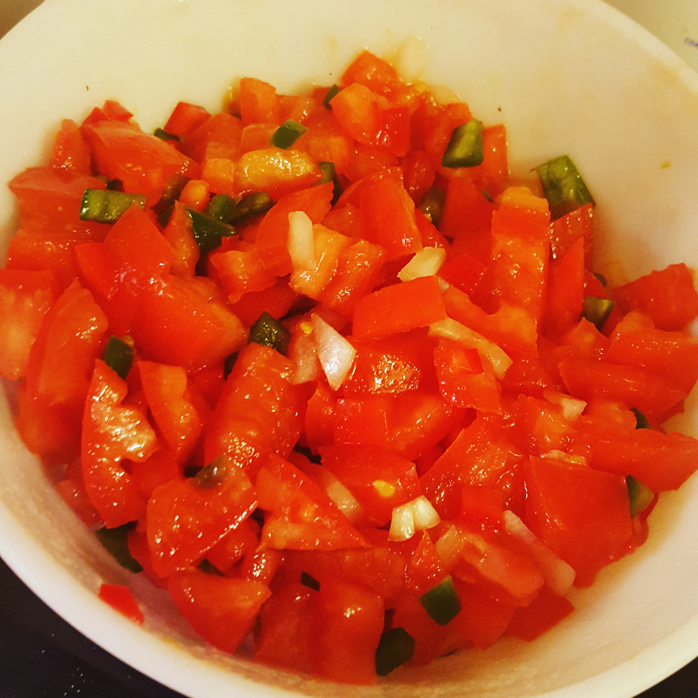

I have been working through a New Years exercise that started with February and breaks the year down into Feb-Apr/May-July/Aug-Oct/Nov-Jan and I'm a little surprised I've never thought of it that way before, because it makes so much sense.

I've been clawing myself out of my Christmas hole in fits and starts. I'm almost entirely functional again - meditating most days, doing magic, doing dishes - so I've been working on the apartment when I have some time. I need more of a work space altar, and my actual work table is buried again, for that matter. There are storage systems to improve, and I am decluttering here and there.

I cleared out most of the random altar crap box that had been sitting since we moved. You know what I don't need any more of for a while? Tea lights. I definitely have a problem. Three full tins and a jar later, I've got them put away where I can actually access them, yay.

Today was a bank holiday and I'm a banker, so I got a holiday. I decided to make salsa from scratch and then on my spouse's suggestion I threw some pinto beans into the instant pot. The salsa recipe was largely based on the What Came In the [Imperfect Box](https://www.imperfectproduce.com/register.php?referral=153855) This Week theory of cuisine:

- 5 roma tomatoes, chopped
- 1 beefsteak tomato, chopped
- 3 jalapeños, chopped fine
- 1 red pepper, chopped
- 1/2 onion, chopped
- Whatever spices are in the spice cabinet
- 1 tsp olive oil
- A good squeeze or two from the lime juice

Mix in a bowl. Let sit for a while in the fridge so flavors mix.

Alton Brown I am not, but it turned out pretty well anyway, and as always I'm reminded that it feels good to cook, to make things, it feels good to have something to show for it at the end of the day. I made a necklace hanger for my spouse and a kid art display for Bug, too.

I didn't get to everything on my list, but I never really do. That's okay.
